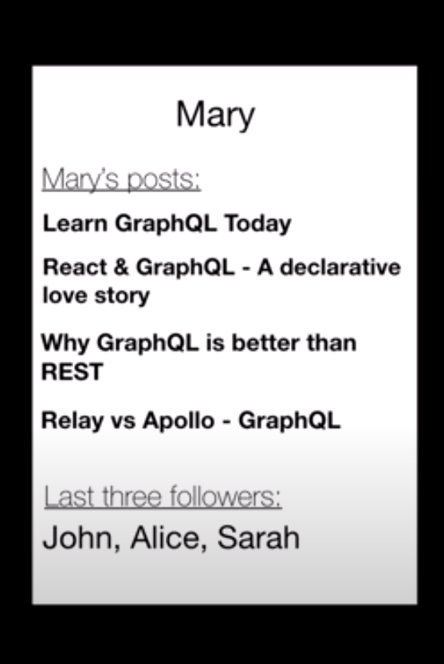

# GraphQL

## Members
    ArshiA Akhavan          97110422
    Mohamadreza Abdi        97110285
    bahar khodabakhshian    97105906

# GraphQl

GraphQl یک استاندارد تازه برای توصیف (Application Programing Interface) API می‌باشد که توسط facebook  توصعه و متن باز شده است.

GraphQl به کلاینت این اجازه را می‌دهد که request خود را به صورت توصیفی بیان کند و دقیقا همان دیتایی را که نیاز دارد از سرور دریافت کند. این به این معنی است که دیگر لازم نیست GraphQl Server تعداد زیادی endpoint برای انواع مختلف request داشته باشد و می‌تواند تمام دیتا ها رو در یک enpoint سرو کند

# GraphQl vs REST

۴ دلیل برای این که از   GraphQl استفاده کنیم:
<ol dir="rtl" style="position:right;">
<li>شمایی با ساختار قوی</li>
<li>رفع مشکل overfetching و underfetching</li>
<li>مجتمع کردن تمام endpoint ها در یک endpoint</li>
<li>دسترس بالای front-end developer ها و سرعت بالا development</li>
</ol>

به مثال زیر توجه کنید:
فرض کنید می‌خواهیم یک صفحه بلاگ دولوپ کنیم.
در این صفحه در بالای آن نام کاربر، سپس در پایین آن ۳ پست اخیر و در آخر هم ۳ تن از دوستان آن کاربر را نشان دهیم(مانند شکل زیر)ف

